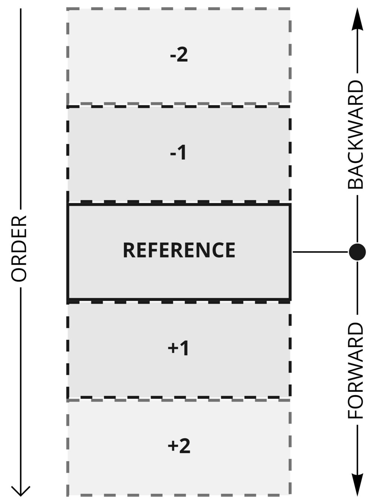

# MR.EntityFrameworkCore.KeysetPagination

<a href="http://use-the-index-luke.com/no-offset">
  
</a>

[](https://github.com/mrahhal/MR.EntityFrameworkCore.KeysetPagination/actions/workflows/ci.yml)
[](https://www.nuget.org/packages/MR.EntityFrameworkCore.KeysetPagination)
[](LICENSE.txt)

Keyset pagination for EF Core (Entity Framework Core). Also known as seek pagination or cursor pagination.

Learn about why the standard offset based pagination (`Take().Skip()`) is bad in many common cases [here](http://use-the-index-luke.com/no-offset).

**Note:** If you're using ASP.NET Core, you can use [MR.AspNetCore.Pagination](https://github.com/mrahhal/MR.AspNetCore.Pagination) which wraps this package and offers an easier to consume keyset pagination behavior with additional features for ASP.NET Core. This is a lower level library that implements keyset pagination for EF Core.

## Usage

`KeysetPaginate` is an extension method on `IQueryable<T>` (same as all other queryable Linq methods), and it takes a few arguments:

```cs
KeysetPaginate(
    // This configures the columns and their order.
    b => b.Ascending(entity => entity.Id),
    // The direction we want to walk relative to the order above (Forward/Backward). Default is Forward.
    direction,
    // The reference entity (used to query previous/next pages). Default is null.
    reference
)
```

Using this method we can do all kinds of keyset queries: first page, previous page, next page, last page.

These queries usually follow the same patterns, shown in the "Common patterns" section. Practical code examples are shown in the "Getting the data" section.

But first, let's talk a bit more about `KeysetPaginate` and how it works.

Here's a small visual representation:



The columns and their configured order are used to order the data, and then the direction decides if we're getting the data before or after the reference row.

**Note:** You'll want to reverse the result whenever you use `KeysetPaginationDirection.Backward` to get the proper order of the data, since walking `Backward` gives results in the opposite order to the configured columns order. There's a helper method on KeysetContext for this, shown in a snippet later.

`KeysetPaginate` returns a context object which you can use to get secondary info and get the data result.

It can be called without direction and reference, in which case this is equivalent to querying the first page:

```cs
KeysetPaginate(
    b => b.Ascending(entity => entity.Id)
)
```

It works with composite keyset as well. Just configure all the columns you want:

```cs
KeysetPaginate(
    b => b.Ascending(entity => entity.Id).Ascending(entity => entity.Score),
    ...
)
```

You can also mix ASC/DESC columns. `KeysetPaginate` knows how to handle that:

```cs
KeysetPaginate(
    b => b.Ascending(entity => entity.Id).Descending(entity => entity.Score),
    ...
)
```

You can also access member using string notation:

```cs
KeysetPaginate(
    b => b.Ascending("id")
)

// Or using dot notation for nested members

KeysetPaginate(
    b => b.Ascending("nested.id")
)
```

**Note:** Review the "Avoiding skipping over data" section for an important note about the columns you're configuring.

## Common patterns

Here are the 4 most common patterns of using `KeysetPaginate`.

#### First page

Not specifying direction and reference gives you the first page of data.

```cs
KeysetPaginate(
    b => ...
)
```

#### Last page

We get the last page by specifying a `Backward` direction.

```cs
KeysetPaginate(
    b => ...,
    KeysetPaginationDirection.Backward
)
```

#### Previous page

You get previous/next pages by providing a direction and a reference. In this case, the reference should be the first item of the current page, and the direction is `Backward`:

```cs
KeysetPaginate(
    b => ...,
    KeysetPaginationDirection.Backward,
    reference
)
```

#### Next page

You get previous/next pages by providing a direction and a reference. In this case, the reference should be the last item of the current page, and the direction is `Forward`:

```cs
KeysetPaginate(
    b => ...,
    KeysetPaginationDirection.Forward,
    reference
)
```

## Getting the data

Let's now see how to work with the context object that `KeysetPaginate` returns.

The following is a basic example usage. We're querying the data and getting back 20 items:

```cs
var keysetContext = dbContext.Users.KeysetPaginate(...);

var users = await keysetContext
    .Query
    .Take(20)
    .ToListAsync();

// As noted in several places above, don't forget to ensure the data is correctly ordered:
keysetContext.EnsureCorrectOrder(users);
```

`KeysetPaginate` returns a context object that includes a `Query` property. This `Query` is what you'll chain more linq operators to and then use to get your data.

The context object itself can be further reused by other helper methods in this package such as `HasPreviousAsync`/`HasNextAsync` to get more info.

As a shortcut for when you don't need this context object, there's a `KeysetPaginateQuery` method:

```cs
var users = await dbContext.Users
    .KeysetPaginateQuery(...)
    .Take(20)
    .ToListAsync();
```

Using the context object with helper methods:

```cs
// Store it in a variable because we'll be using it in more than one way.
var keysetContext = dbContext.Users
    .KeysetPaginate(...);

// First, we'll get our actual data. We do this by using the `Query` property.
var users = await keysetContext.Query
    .Take(20)
    .ToListAsync();
// Make sure you call EnsureCorrectOrder before anything else.
keysetContext.EnsureCorrectOrder(users);

// This is true when there is more data before the returned list.
var hasPrevious = await keysetContext.HasPreviousAsync(users);

// This is true when there is more data after the returned list.
var hasNext = await keysetContext.HasNextAsync(users);
```

`HasPreviousAsync`/`HasNextAsync` are useful when you want to know when to render Previous/Next (Older/Newer) buttons.

**Note**: The reference/data these methods accept are loosely typed to allow flexibility when projecting your models (to DTOs for example). For more info check [this document](./docs/loose-typing.md).

Here's another example showing how to obtain the total count for the data to display somewhere:

```cs
// Assuming we're in an api that should return admin users.

// Prepare the base query first.
var query = dbContext.Users.Where(x => x.IsAdmin);

// This will be the count of all admins.
var count = await query.CountAsync();

// And then we apply keyset pagination at the end.
// `KeysetPaginate` adds ordering and more predicates to the query so we have to get the count before we apply it.
var keysetContext = query.KeysetPaginate(...);
var admins = await keysetContext.Query
    .Take(20)
    .ToListAsync();

// You can optionally use the context object too as explained above to get additional info.
keysetContext.EnsureCorrectOrder(admins);
```

## Nested properties

Nested properties are also supported when defining a keyset. Just make sure the reference contains the same nested chain of properties.

```cs
// If you're using a loaded entity for the reference.
var reference = await dbContext.Users
    // Load it, otherwise you won't get the correct result.
    .Include(x => x.Nested)
    .FirstOrDefaultAsync(x => x.Id == id);

// If you're using another type for the reference.
var reference = new
{
    Nested = new
    {
        Created = ...,
    },
};

var keysetContext = dbContext.Users.KeysetPaginate(
    // Defining the keyset using a nested property.
    b => b.Ascending(entity => entity.Nested.Created),
    direction,
    reference);
var result = await keysetContext.Query
    // You'll want to load it here too if you plan on calling any context methods.
    .Include(x => x.Nested)
    .Take(20)
    .ToListAsync();
```

## Json properties

Nested Json properties are also supported when defining a keyset. Just make sure the reference contains the same nested chain of properties.

```cs
// If you're using a loaded entity for the reference.
var reference = await dbContext.NestedJsonEntities
    // Load it, otherwise you won't get the correct result.
    .Include(x => x.Inner)
    .FirstOrDefaultAsync(x => x.Id == id);

// If you're using another type for the reference.
new NestedJsonModel
{
    Inner = new NestedInnerJsonModel
    {
        Created = created,
        Data = System.Text.Json.JsonDocument.Parse($"{{\"nbInt\":{i},\"nbString\":\"{i}\",\"created\":\"{created}\"}}")
    },
};

// Using member expression access
var keysetContext = dbContext.Users.KeysetPaginate(
    // Defining the keyset using a nested Json property.
    b => b.Ascending(entity => entity.Inner.Data.RootElement.GetProperty("nbInt").GetInt32()),
    direction,
    reference);

// Using string property member access with converter passed in parameter
// Recommended to store the Getter method in a cache using member access string as key
var keysetContext = dbContext.Users.KeysetPaginate(
    // Defining the keyset using dot notation to access a nested Json property.
    b => b.Ascending("inner.data.nbInt",
                    typeof(JsonElement).GetMethod(nameof(JsonElement.GetString),
                        bindingAttr: BindingFlags.IgnoreCase |
                                        BindingFlags.Instance |
                                        BindingFlags.Static |
                                        BindingFlags.Public,
                        null,
                        new Type[] { }, null)),
    direction,
    reference);

var result = await keysetContext.Query
    // You'll want to load it here too if you plan on calling any context methods.
    .Include(x => x.Inner)
    .Take(20)
    .ToListAsync();
```

## Enum support

Enum properties are also supported when defining a keyset.

Consider class:

```cs
public enum EnumType : int // Not mandatory to specify the underlying type
{
	ALL = -1,
	None,
}
public class EnumModel
{
    public int Id { get; set; }

    public EnumType EnumType { get; set; }
}
```

You can query it:
```cs
var keysetContext = dbContext.Users.KeysetPaginate(
    // Defining the keyset using a nested Json property.
    b => b.Ascending(entity => entity.EnumType),
    direction,
    reference);
```


## Avoiding skipping over data

You'll want to make sure the combination of the columns you configure uniquely identify an entity, otherwise you might skip over data while navigating pages. This is a general rule to keep in mind when doing keyset pagination.

If you have configured some columns that don't uniquely identify entities, an easy fix is to just add the `Id` column to the configured columns.

Doing this correctly means you'll never skip over or duplicate data, a behavior that offset based pagination can never guarantee.

## Indexing

Keyset pagination, as is the case with any other kind of query, can benefit a lot from good database indexing. In the case of keyset pagination, you'll want to add a composite index that is compatible with the columns and the order of the query.

Here's an example. Let's say we're doing the following pagination query:

```cs
KeysetPaginate(
    b => b.Descending(entity => entity.Created),
    ...
)
```

You'll want to add an index on the `Created` column for this query to be as fast as it can.

Another more complex example:

```cs
KeysetPaginate(
    b => b.Descending(entity => entity.Score).Ascending(entity => entity.Id),
    ...
)
```

In this case you'll want to create a composite index on `Score` + `Id`, but make sure they're compatible with the order above. i.e You'll want to make the index descending on `Score` and ascending on `Id` (or the opposite) for it to be effective.

**Note**: Refer to [this document](https://docs.microsoft.com/en-us/ef/core/modeling/indexes) on how to create indexes with EF Core. Note that right now you can't specify the sorting of the index in EF Core when creating a composite index. You might have to create the index in raw sql if you need to do that. This issue is tracked here: https://github.com/dotnet/efcore/issues/4150.

## Caveats

Check [this document](docs/caveats.md) on a few caveats to keep in mind when working with keyset pagination.

## Samples

Check the [samples](samples) folder for project samples.

- [Basic](samples/Basic): This is a quick example of a page that has First/Previous/Next/Last links (using razor pages).

## Talks

[.NET Standup session](https://www.youtube.com/watch?v=DIKH-q-gJNU) where we discuss pagination and showcase this package.
